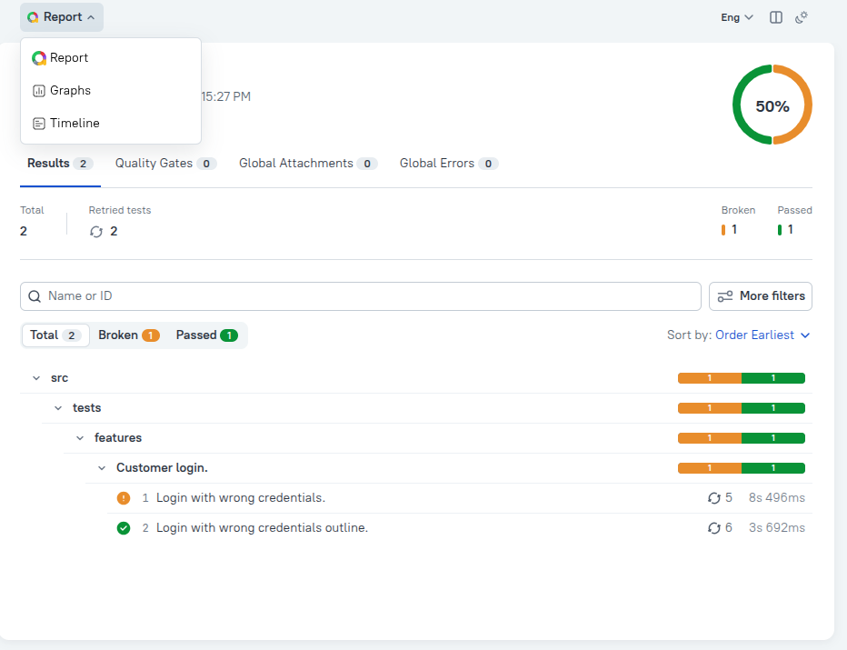

# Cucumber-Playwright-TypeScript-BDD-Template


A starter template that uses Page Object model (POM) for writing E2E tests based on Cucumber v12 and Playwright using TypeScript.

## What the template contains

1. Sample features and steps
2. Base setup for launching/closing browser
3. Base setup for creating/closing browser context
4. Hooks to manage tests lifecycle
5. Report generation using Allure with images attached
6. Tags for filtering tests to run
7. Parallel testing and reruns
8. Logging using Winston
9. Prettier, ESLint, Husky configuration
10. CI/CD using GitHub Actions

## Project Structure

```
.
├── src/
│   ├── features/                 # Gherkin feature files
│   │   └── *.feature
│   │
│   ├── steps/                    # Step definitions
│   │   └── *.steps.ts
│   │
│   ├── pages/                    # Page Object Model (POM)
│   │   └── *.page.ts
│   │
│   ├── support/                  # Test lifecycle & configuration
│   │   ├── hooks.ts              # Before / After hooks
│   │   ├── webConfig.ts          # Custom World for Cucumber
│   │
│   │
│   │
│   └── utils/                    # Shared helpers & utilities
│       └── *.ts
│
├── screenshots/                  # Screenshots captured on failures
│
├── allure-results/               # Allure raw results (generated)
│
├── .husky/                       # Git hooks (pre-commit, commit-msg)
│
├── .env                          # Environment variables
├── cucumber.js                   # Cucumber configuration
├── playwright.config.ts          # Playwright configuration
├── tsconfig.json                 # TypeScript configuration
├── eslint.config.mts             # ESLint flat config
├── .prettierrc                   # Prettier configuration
├── .prettierignore
├── package.json
├── pnpm-lock.yaml
├── README.md
├── badge.svg                     # Status badge
└── report.png                    # Sample Allure report
```

## Usage

Create a repo based on this template and start writing your tests.

> _Note: When creating the template I used pnpm_

## How to run your tests

1.  Ensure you are in the root directory of your project

        cd /path/to/your/project

2.  Install all dependencies

        pnpm install

3.  Run all tests

        pnpm test

4.  Run tests with a specific tag

        pnpm test --tags <tag>

5.  To ignore a scenario tag the scenario with @ignore

## How to select browser

Currently, chromium and firefox are the only available browser options in the project. However, users can add more browser options in the following file: **_./src/support/webConfig.ts_**

To assign a browser that will be used in your project, you should define an environmental variable called BROWSER and set the name of the browser. Available options: `chromium`, `firefox`

        BROWSER=firefox pnpm test

> **Note: If BROWSER environmental variable is not provided, we use chromium by default.**

## How to generate and view reports

The project uses allure for reports. Run the following command:

        pnpm allure

Sample report image:

